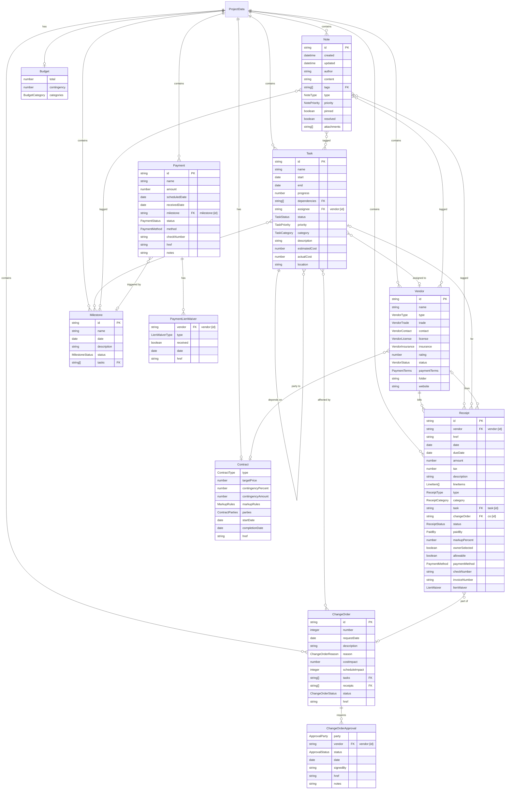
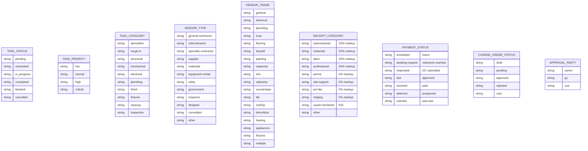
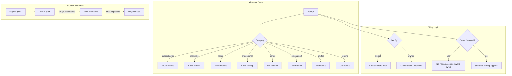
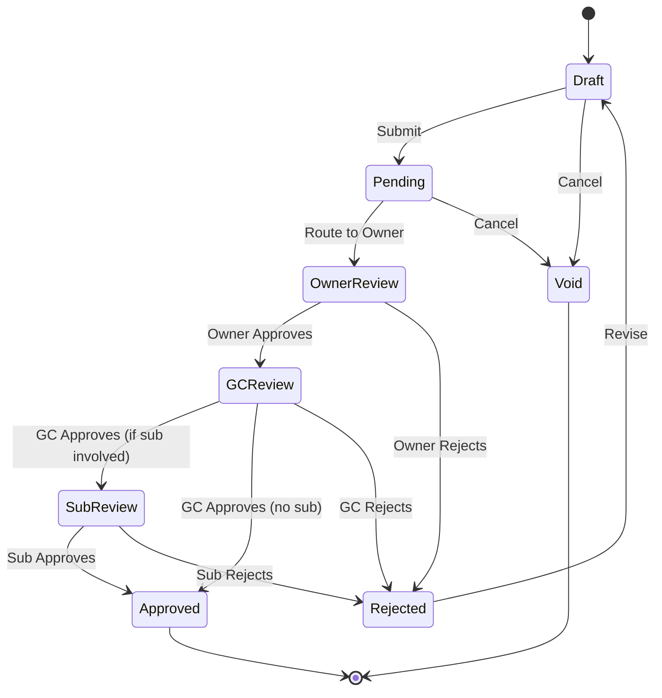

# Project Data Model ERD

Entity Relationship Diagram for the White Doe Inn project management data model.

## Full Entity Diagram

## Enumerations

## Tag Reference System

The data model uses a flexible tag-based reference system:

| Tag Format | Example | Description |
|------------|---------|-------------|
| `vendor:{id}` | `vendor:weathertek` | Reference to a vendor |
| `task:{id}` | `task:demolition` | Reference to a task |
| `receipt:{id}` | `receipt:inv-001` | Reference to a receipt |
| `milestone:{id}` | `milestone:rough-in-complete` | Reference to a milestone |
| `co:{id}` | `co:co-001` | Reference to a change order |
| `project` | `project` | Project-level reference |

## Cost-Plus Contract Flow

## Change Order Approval Flow

## File References

- **Schema**: `projects/_schema/project-data.schema.json`
- **TypeScript Types**: `src/types/project-data.d.ts`
- **Project Data**: `projects/kitchen-remodel/data.json`
